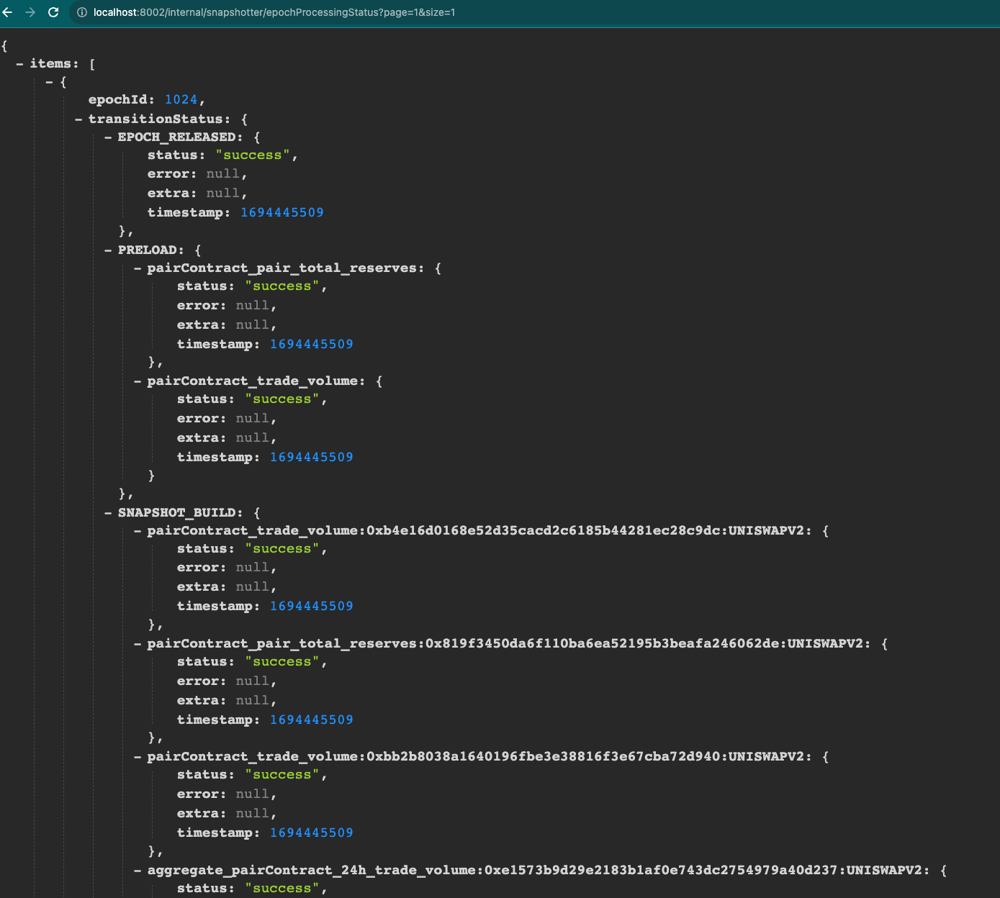
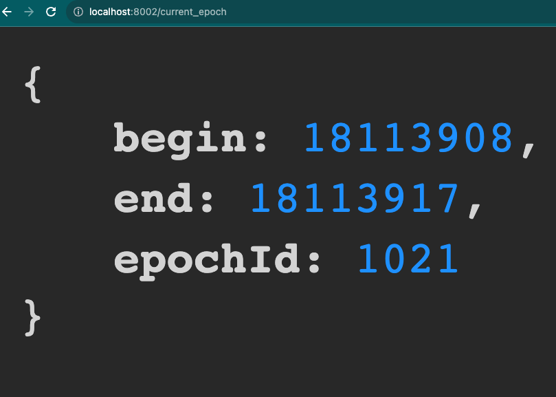

# PowerLoom Deployment
Scripts to deploy PowerLoom services ([audit-protocol](https://github.com/PowerLoom/audit-protocol) and [pooler](https://github.com/PowerLoom/pooler)) to [Powerloom network](https://onchain-consensus.powerloom.io).

> Note: We just announced an incentivized testnet, [register here](https://coinlist.co/powerloom-testnet) to participate in the network.

## Requirements

1. Latest version of `docker` (`>= 20.10.21`) and `docker-compose` (`>= v2.13.0`)
2. At least 4 core CPU, 8GB RAM and 50GB SSD - make sure to choose the correct spec when deploying to Github Codespaces.
3. IPFS node
    - While we have __included__ a node in our autobuild docker setup, IPFS daemon can hog __*a lot*__ of resources - it is not recommended to run this on a personal computer unless you have a strong internet connection and dedicated CPU+RAM.
    - 3rd party IPFS services that provide default IFPS interface like Infura are now supported.
4. RPC URL for `Ethereum mainnet`. We recommend running a full geth node to save costs and to stick to ethos of decentralization! :)
> This pretest simulation setup is designed to only work with a paid plans on any of the RPC providers like [Alchemy](https://alchemy.com/?r=15ce6db6d0a109d5), [Infura](https://infura.io), [Quicknode](https://www.quicknode.com?tap_a=67226-09396e&tap_s=3491854-f4a458), etc. Please reach out to us if none of the options are viable.

## For snapshotters (pretask simulation only)

1. Clone the repository against the pretask simulation.

 `git clone https://github.com/PowerLoom/deploy.git --single-branch powerloom_testnet_pretask --branch testnet_pretask && cd powerloom_testnet_pretask`

2. Copy `env.example` to `.env`.
   - Ensure the following required variables are filled:
     - `SOURCE_RPC_URL`: The URL for the source RPC (Local node/Infura/Alchemy) service.
     - `SIGNER_ACCOUNT_ADDRESS`: The address of the signer account. This is your whitelisted address on testnet - please file [a ticket](https://discord.com/channels/777248105636560948/1146936525544759457) if you need a new burner wallet registered.
     - `SIGNER_ACCOUNT_PRIVATE_KEY`: The private key corresponding to the signer account address.

3. Open a screen by typing `screen` and then follow instructions by running

    `./build.sh`

    If the `.env` is filled up correctly, all services will execute one by one. The logs do fill up quick. So, remember to [safely detach](https://linuxize.com/post/how-to-use-linux-screen/) from screen when not using it. If you see the following error, your snapshotter address is not registered.

    ```
    deploy-pooler-1           | Snapshotter identity check failed on protocol smart contract
    deploy-pooler-1 exited with code 1
    ```

   
4. Check if all the necessary docker containers are up and running. You should see an output against `docker ps` with the following cotnainers listed:

    ```
    # docker ps

    CONTAINER ID   IMAGE                                  COMMAND                  CREATED       STATUS                 PORTS                                                                                                                                                 NAMES
    bfa1abe2b8aa   powerloom-pooler-frontend              "sh -c 'sh snapshott…"   2 hours ago   Up 2 hours (healthy)   0.0.0.0:3000->3000/tcp, :::3000->3000/tcp                                                                                                             deploy-pooler-frontend-1
    852f3445f11c   powerloom-pooler                       "bash -c 'sh init_pr…"   2 hours ago   Up 2 hours (healthy)   0.0.0.0:8002->8002/tcp, :::8002->8002/tcp, 0.0.0.0:8555->8555/tcp, :::8555->8555/tcp                                                                  deploy-pooler-1
    ee652fda8513   powerloom-audit-protocol               "bash -c 'sh init_pr…"   2 hours ago   Up 2 hours (healthy)   0.0.0.0:9000->9000/tcp, :::9000->9000/tcp, 0.0.0.0:9002->9002/tcp, :::9002->9002/tcp                                                                  deploy-audit-protocol-1
    5547fb5c1ab4   ipfs/kubo:release                      "/sbin/tini -- /usr/…"   2 hours ago   Up 2 hours (healthy)   4001/tcp, 8080-8081/tcp, 4001/udp, 0.0.0.0:5001->5001/tcp, :::5001->5001/tcp                                                                          deploy-ipfs-1
    999de5864a1b   rabbitmq:3-management                  "docker-entrypoint.s…"   2 hours ago   Up 2 hours (healthy)   4369/tcp, 5671/tcp, 0.0.0.0:5672->5672/tcp, :::5672->5672/tcp, 15671/tcp, 15691-15692/tcp, 25672/tcp, 0.0.0.0:15672->15672/tcp, :::15672->15672/tcp   deploy-rabbitmq-1
    2c14926d7cfd   redis                                  "docker-entrypoint.s…"   2 hours ago   Up 2 hours (healthy)   0.0.0.0:6379->6379/tcp, :::6379->6379/tcp                                                                                                             deploy-redis-1
    ```

5. To be sure whether your snapshotter is processing epochs and submitting snapshots for consensus, run the following internal API query on Pooler Core API from your browser.

> For detailed documentation on internal APIs and the low level details exposed by them, refer to the Pooler docs.

**Tunnel from your local machine to the remote deploy instance on the [`core_api`](https://github.com/PowerLoom/pooler/tree/testnet_pretask#core-api) port**

This opens up port 8002.

```
ssh -nNTv -L 8002:localhost:8002 root@<remote-instance-IP-address>
```

Replace `<remote-instance-IP-address>` with the IPv4 address of the remote deploy instance.

The following query will return the processing status of the last epoch as it passes through the different state transitions.

**Check epoch processing status**

Visit `http://localhost:8002/internal/snapshotter/epochProcessingStatus?page=1&size=1` on your browser to know the status of the latest epoch processed by Pooler.



Most of the project IDs as captured at every state transition should show a status of `success`.

**Check the current epoch on the protocol**

Visit `http://localhost:8002/current_epoch` on your browser to know the current epoch being processed by the protocol. If the `epochId` field from the previous query and this one are too far apart, the deploy setup is most likely 

* running into RPC issues, or 
* system resource limit issues which causes the host to kill off processes




6. We have setup a bare-bones consensus dashboard at: [powerloom.network](https://pretest-consensus.powerloom.io/projects/aggregate_24h_stats_lite:9fb408548a732c85604dacb9c956ffc2538a3b895250741593da630d994b1f27:UNISWAPV2). In a 5-10 minutes, your snapshotter address will start show up - use the search box to filter the results.

7. Once all the services are up and running, the front-end can be accessed via [Pooler Frontend](http://localhost:3000) to see a UNISWAPV2 summary data dashboard similar to [PowerLoom UNISWAPV2 Prod](https://uniswapv2.powerloom.io/).
    - A sample screenshot of the dashboard is given [here](./sample_images/pooler-frontend.jpg)

    - This will also give an idea in case your snapshotting has fallen behind as you can notice from the time of last snapshot shown in the screenshot.

    - Note that the data shown in your own dashboard will not be same as production UI on PowerLoom.io as the "lite mode" is only set to snapshot 7 pair contracts. Refer to contributors section below to enable all pairs.


8. To shutdown services, just press `Ctrl+C` (and again to force).

    > If you don't keep services running for extended periods of time, this will affect consensus and we may be forced to de-activate your snapshotter account.
    
9. If you see issues with data, you can do a clean *reset* by running the following command before restarting step 3:

    `docker-compose --profile ipfs down --volumes`
